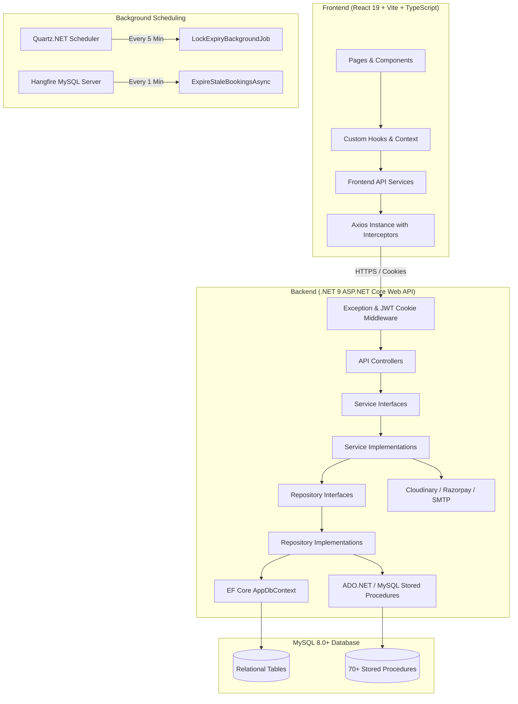
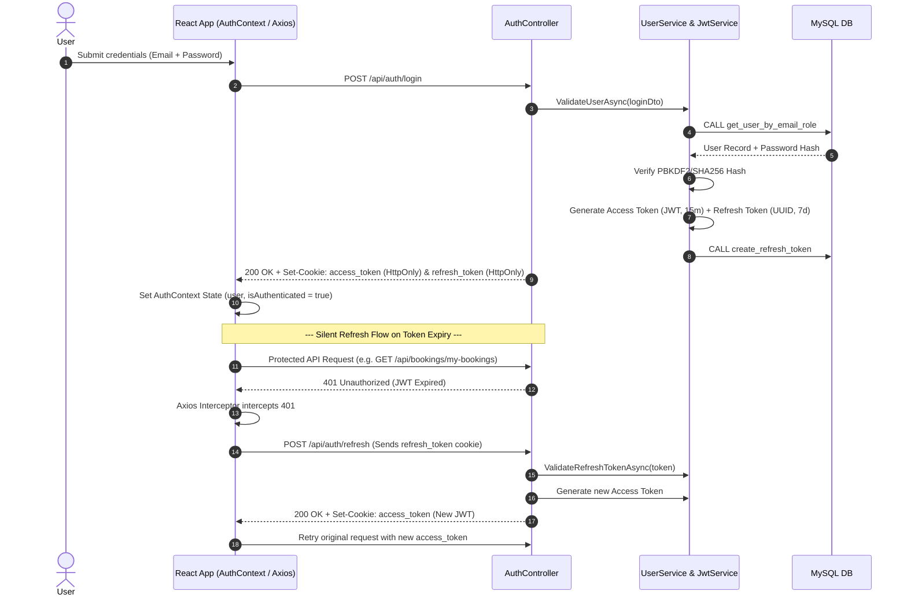
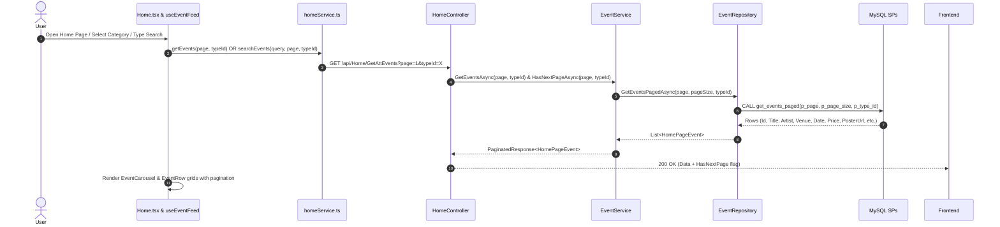
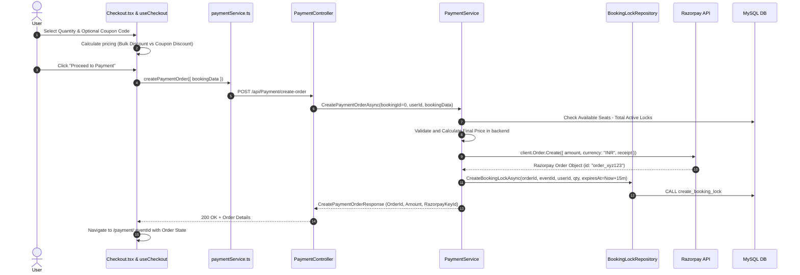
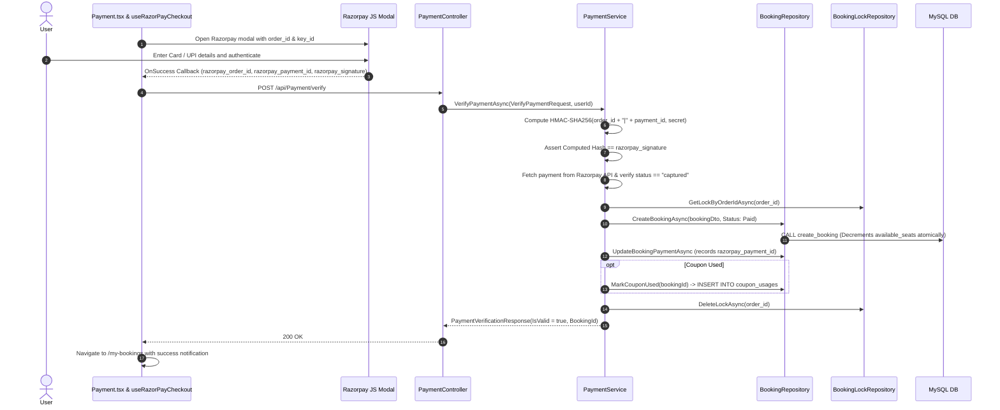
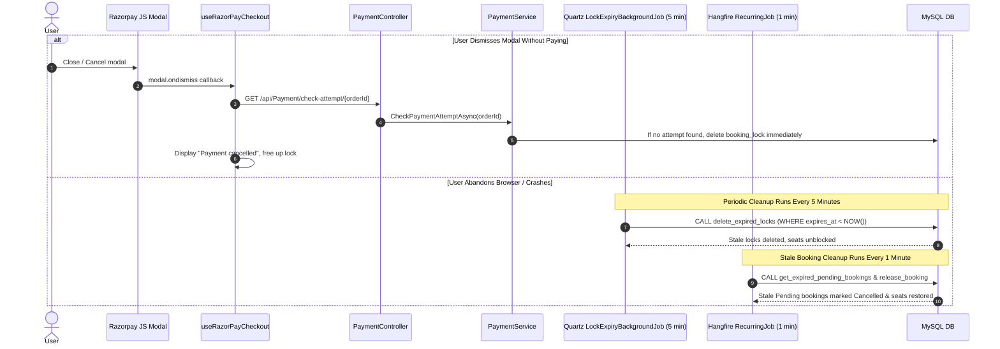
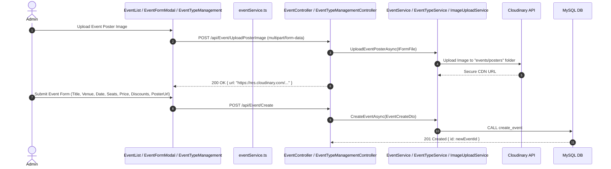

# Resonance Ticket Booking Platform — Comprehensive Technical Architecture & Code-Level Flow Specification

## 1. Project Overview & System Architecture

**Resonance** is a full-stack, enterprise-grade event ticket booking and management platform. It is engineered using an **N-Tier Clean Architecture** on the backend (.NET 9 / ASP.NET Core Web API) with a MySQL relational database layer utilizing optimized Stored Procedures and EF Core, and a modern, modular **React 19 + TypeScript (Vite)** single-page application on the frontend styled with Material UI (MUI).



---

## 2. Technology Stack & Key Libraries

### Backend Stack
- **Framework**: .NET 9.0 (C# 13), ASP.NET Core Web API
- **ORM & Data Access**: Entity Framework Core 9 (MySQL Pomelo connector with snake_case naming), ADO.NET / Stored Procedures for atomic high-concurrency workflows
- **Database**: MySQL 8.0+
- **Authentication & Security**: JWT (JSON Web Tokens) with HMAC-SHA256 signing, stored in `HttpOnly`, `SameSite=Strict`, `Secure` cookies; PBKDF2 / SHA-256 salted password hashing
- **Payment Gateway**: Razorpay .NET SDK (Order generation, HMAC-SHA256 signature verification)
- **Image Storage**: Cloudinary .NET SDK (Event poster uploads with automatic transformation)
- **Background Schedulers**: 
  - **Quartz.NET**: 5-minute periodic scan for orphaned/expired seat locks (`BookingLocks`)
  - **Hangfire**: 1-minute recurring job to release unpaid pending bookings
- **Email Service**: System.Net.Mail SMTP client for password recovery
- **API Documentation**: Swagger / OpenAPI with Bearer/Cookie authentication schemas

### Frontend Stack
- **Runtime & Build Tool**: React 19, TypeScript, Vite
- **UI Framework**: Material UI (MUI v6 / Emotion), Lucide React icons
- **State Management**: React Context API (`AuthContext`), Domain-specific custom hooks
- **Routing**: React Router DOM v7 (Data & Declarative routing with Admin / User Layout guards)
- **Form Management & Validation**: React Hook Form, Zod schema validation
- **HTTP Client**: Axios with automatic 401 token refresh interceptor & credential sharing (`withCredentials: true`)
- **Payment Client**: Dynamic Razorpay Checkout Javascript SDK

---

## 3. Database Schema & Concurrency Locking Strategy

### Entity Relationship Model

| Entity | Primary Key | Key Relationships / Constraints | Core Responsibility |
|---|---|---|---|
| `User` | `Id` (INT Auto) | Unique `Email`, Unique `MobileNumber` | Stores user credentials, roles (`Admin`, `User`), profile |
| `RefreshToken` | `Id` (INT Auto) | FK `UserId` -> `User.Id` (Restrict) | Persists hashed refresh tokens for seamless session extension |
| `PassWordResetToken` | `Id` (INT Auto) | FK `UserId` -> `User.Id` (Cascade) | Secure single-use token with expiration for password resets |
| `EventType` | `Id` (INT Auto) | 1-to-Many -> `EventCategory` | Top-level taxonomy (e.g., Concert, Theater, Sports) |
| `EventCategory` | `Id` (INT Auto) | FK `EventTypeId` -> `EventType.Id` | Sub-taxonomy (e.g., Rock, Classical, Football) |
| `Event` | `Id` (INT Auto) | FK `EventCategoryId` -> `EventCategory.Id` | Event details, venue, date, ticket price, total & available seats, bulk discount rules |
| `Coupon` | `Id` (INT Auto) | Unique `Code` | Global/scoped discount coupons with percentage & max cap |
| `CouponUsage` | `Id` (INT Auto) | Unique `(CouponId, UserId)` | Enforces single-use per user rule |
| `EventCouponCode` | `Id` (INT Auto) | Unique `(CouponId, EventId)` | Many-to-Many mapping linking coupons to eligible events |
| `BookingLock` | `Id` (INT Auto) | Unique `RazorpayOrderId`, Index `ExpiresAt`, Index `EventId` | **Pessimistic concurrency lock** holding seats during the 15-minute checkout window |
| `Booking` | `Id` (INT Auto) | FK `UserId`, FK `EventId`, FK `CouponId` | Final recorded order with financial breakdown and status (`Pending`, `Paid`, `Failed`, `Cancelled`) |

### High-Concurrency Seat Locking Architecture
To eliminate race conditions and double-booking during peak ticket drops:
1. When a user clicks **"Proceed to Payment"**, no `Booking` row is immediately written to the database.
2. Instead, the backend invokes stored procedure `create_booking_lock` which atomically verifies available capacity minus active locks (`evt.AvailableSeats - totalLocked >= requestedSeats`) and registers a temporary row in `booking_locks` with a 15-minute expiration time (`expires_at`).
3. If payment succeeds, `VerifyPaymentAsync` converts the lock into an official `Booking` record with `Status = Paid`, decrements `events.available_seats`, marks coupon usage, and deletes the `BookingLock`.
4. If payment fails or the user dismisses the checkout, the lock is dropped. If the user abandons the tab, Quartz.NET automatically expires and purges the lock after 15 minutes.

---

## 4. End-to-End Execution Flows (Code-Level Step-by-Step)

### Flow 1: Authentication, Authorization & Seamless Token Refresh



#### Code-Level Flow Instructions:
1. **Login Trigger**: `UserLogin.tsx` calls `loginUser()` in [authService.ts](file:///d:/TicketBooking/frontend/TicketBooking/src/services/authService.ts).
2. **Backend Controller**: [AuthController.cs](file:///d:/TicketBooking/BackEnd/TicketBooking.WebApi/Controller/AuthController.cs) receives `UserLoginDto`.
3. **Password Validation**: [UserService.cs](file:///d:/TicketBooking/BackEnd/TicketBooking.Service/Service/Implementation/UserService.cs) calls [UserRepository.cs](file:///d:/TicketBooking/BackEnd/TicketBooking.Repository/Repository/Implementation/UserRepository.cs) running SP `get_user_by_email_role`. Hashes are matched.
4. **Cookie Generation**: [JwtService.cs](file:///d:/TicketBooking/BackEnd/TicketBooking.Service/Service/Implementation/JwtService.cs) creates a signed JWT with claims (`NameIdentifier`, `Email`, `Role`, `GivenName`). Cookies `access_token` and `refresh_token` are written with `HttpOnly = true`, `Secure = true`, `SameSite = Strict`.
5. **Session Interception**: In [axios.ts](file:///d:/TicketBooking/frontend/TicketBooking/src/api/axios.ts), an Axios response interceptor monitors for HTTP 401. If triggered and not already retrying, it calls `/api/auth/refresh`, refreshes the cookie, and automatically replays the original failed request.

---

### Flow 2: Event Discovery, Searching & Category Filtering



#### Code-Level Flow Instructions:
1. **UI State**: [Home.tsx](file:///d:/TicketBooking/frontend/TicketBooking/src/pages/user/Home.tsx) invokes [useEventFeed.ts](file:///d:/TicketBooking/frontend/TicketBooking/src/hooks/event/useEventFeed.ts) and [useEventTypes.ts](file:///d:/TicketBooking/frontend/TicketBooking/src/hooks/event/useEventTypes.ts).
2. **Type Filter Chips**: Selecting an `EventType` updates `selectedTypeId`, triggering a reactive fetch in `homeService.getEvents()`.
3. **Stored Procedure Execution**: [EventRepository.cs](file:///d:/TicketBooking/BackEnd/TicketBooking.Repository/Repository/Implementation/EventRepository.cs) executes `get_events_paged.sql` which applies active status filters, future date constraints (`event_date >= NOW()`), and SQL `LIMIT` / `OFFSET` pagination.
4. **Debounced Search**: If `searchQuery` is populated, `useEventFeed` invokes `/api/Home/SearchEvents` which calls `search_events.sql` with full-text title and artist matching.

---

### Flow 3: Checkout, Dynamic Discount Rules & Order Locking



#### Code-Level Flow Instructions:
1. **Frontend Calculations**: [useCheckout.ts](file:///d:/TicketBooking/frontend/TicketBooking/src/hooks/checkout/useCheckout.ts) computes pricing in real-time. If coupon is entered, [useCoupons.ts](file:///d:/TicketBooking/frontend/TicketBooking/src/hooks/checkout/useCoupons.ts) calls `/api/bookings/apply-coupon`. Coupon discounts take precedence over bulk discounts.
2. **Order & Lock Initialization**: In [PaymentController.cs](file:///d:/TicketBooking/BackEnd/TicketBooking.WebApi/Controller/PaymentController.cs), `CreatePaymentOrder` delegates to [PaymentService.cs](file:///d:/TicketBooking/BackEnd/TicketBooking.Service/Service/Implementation/PaymentService.cs).
3. **Lock Verification**: `PaymentService` queries [BookingLockRepository.cs](file:///d:/TicketBooking/BackEnd/TicketBooking.Repository/Repository/Implementation/BookingLockRepository.cs) using SP `get_total_locked_quantity`. If `available - locked < requested`, throws `BusinessRuleException`.
4. **Razorpay Order Creation**: Initialized with amount in paise (`finalAmount * 100`).
5. **Pessimistic Hold**: `BookingLockRepository` executes `create_booking_lock.sql`, saving all discount figures, user ID, event ID, and expiration timestamp.

---

### Flow 4: Razorpay Payment Execution & Signature Verification



#### Code-Level Flow Instructions:
1. **SDK Invocation**: [useRazorPayCheckout.ts](file:///d:/TicketBooking/frontend/TicketBooking/src/hooks/payment/useRazorPayCheckout.ts) opens the Razorpay iframe.
2. **Signature Verification**: [PaymentService.cs](file:///d:/TicketBooking/BackEnd/TicketBooking.Service/Service/Implementation/PaymentService.cs) uses `HMACSHA256` with the server-side Razorpay Key Secret. If the signature is forged, the lock is purged and a 400 is returned.
3. **Status Check**: Razorpay API is called via `client.Payment.Fetch(paymentId)` to verify `captured` status.
4. **Booking Materialization**: Stored procedure `create_booking.sql` executes inside a database transaction:
   - Verifies remaining seats
   - Inserts row into `bookings` table
   - Decrements `events.available_seats`
   - If coupon attached, `mark_coupon_used.sql` records user/coupon pair in `coupon_usages` to prevent reuse
   - The transient row in `booking_locks` is removed via `delete_lock_by_order_id.sql`.

---

### Flow 5: Payment Dismissal, Failure & Background Cleanup Jobs



#### Code-Level Flow Instructions:
1. **Immediate Release on Modal Dismiss**: In [useRazorPayCheckout.ts](file:///d:/TicketBooking/frontend/TicketBooking/src/hooks/payment/useRazorPayCheckout.ts), `modal.ondismiss` triggers `checkPaymentAttempt(orderId)`. [PaymentService.cs](file:///d:/TicketBooking/BackEnd/TicketBooking.Service/Service/Implementation/PaymentService.cs) calls Razorpay's API to inspect if a charge attempt was recorded. If none, `bookingLockRepo.DeleteLockAsync(orderId)` immediately unlocks seats.
2. **Quartz Scheduler**: [LockExpiryBackgroundJob.cs](file:///d:/TicketBooking/BackEnd/TicketBooking.Service/BackgroundJobs/LockExpiryBackgroundJob.cs) executes `delete_expired_locks.sql` every 5 minutes to sweep away locks abandoned by closed browser sessions.
3. **Hangfire Scheduler**: Configured in [Program.cs](file:///d:/TicketBooking/BackEnd/TicketBooking.WebApi/Program.cs) (`RecurringJob.AddOrUpdate<IBookingService>("expire-stale-bookings", ...)`), runs every 60 seconds to release seats for any legacy `Pending` booking past its timeout.

---

### Flow 6: Admin Event & Taxonomy Management



#### Code-Level Flow Instructions:
1. **Taxonomy Structure**: [EventTypeManagementController .cs](file:///d:/TicketBooking/BackEnd/TicketBooking.WebApi/Controller/EventTypeManagementController%20.cs) provides full hierarchical CRUD for `EventType` (e.g. Sports, Music) and child `EventCategory` (e.g. Football, Rock).
2. **Safe Deletion Checks**: Before deleting a type or category, the backend executes stored procedures `check_event_type_deletability.sql` and `check_event_category_deletability.sql`. If active events depend on them, a `422 Unprocessable Entity` is returned with an informative message.
3. **Cloudinary Asset Pipeline**: [ImageUploadService.cs](file:///d:/TicketBooking/BackEnd/TicketBooking.Service/Service/Implementation/ImageUploadService.cs) validates MIME types, image size, and uploads the stream directly to Cloudinary, returning a secure CDN URL saved in the `events.poster_image_url` column.

---

## 5. Major Folder Breakdown & Responsibilities

```
d:\TicketBooking\
├── BackEnd\
│   ├── TicketBooking.WebApi\         # Presentation Layer: Controllers, Middleware, Host
│   ├── TicketBooking.Service\        # Business Logic Layer: Services, Background Jobs
│   └── TicketBooking.Repository\     # Data Access Layer: EF Core, Repositories, DTOs, Entities
├── DB\
│   └── SP\                           # Stored Procedures & DB Migration scripts
└── frontend\
    └── TicketBooking\
        └── src\                      # React 19 Client SPA Source
```

---

### Backend Folder Structure & Responsibilities

#### 1. `BackEnd/TicketBooking.WebApi/`
The entry point and HTTP presentation tier of the application.
- **[Program.cs](file:///d:/TicketBooking/BackEnd/TicketBooking.WebApi/Program.cs)**:
  - Configures Dependency Injection for all Repositories and Services.
  - Registers EF Core `AppDbContext` with MySQL Pomelo and snake_case naming conventions.
  - Configures JWT Bearer authentication and extracts tokens from HTTP-only cookies (`access_token`).
  - Initializes Quartz.NET Scheduler for lock expiration and Hangfire Server for background recurring jobs.
  - Configures CORS policies (`ReactFrontEnd` origin with credentials allowed).
  - Configures custom global `ExceptionMiddleware`.
- **`Controller/`**:
  - [AuthController.cs](file:///d:/TicketBooking/BackEnd/TicketBooking.WebApi/Controller/AuthController.cs): Endpoints for User & Admin registration, login, silent refresh, logout, password recovery, and `current-user` profile data.
  - [BookingController.cs](file:///d:/TicketBooking/BackEnd/TicketBooking.WebApi/Controller/BookingController.cs): Endpoints for checkout validation (`/validate-checkout`), coupon application (`/apply-coupon`), user booking history (`/my-bookings`), and booking cancellation/release.
  - [PaymentController.cs](file:///d:/TicketBooking/BackEnd/TicketBooking.WebApi/Controller/PaymentController.cs): Razorpay order generation (`/create-order`), cryptographic payment verification (`/verify`), payment attempt checks (`/check-attempt`), and manual lock releases.
  - [EventController.cs](file:///d:/TicketBooking/BackEnd/TicketBooking.WebApi/Controller/EventController.cs): Admin-protected CRUD endpoints for events and multipart poster uploads to Cloudinary.
  - [EventTypeManagementController .cs](file:///d:/TicketBooking/BackEnd/TicketBooking.WebApi/Controller/EventTypeManagementController%20.cs): Admin endpoints for managing Event Types and sub-categories with relationship validation.
  - [CouponController.cs](file:///d:/TicketBooking/BackEnd/TicketBooking.WebApi/Controller/CouponController.cs): Admin CRUD for discount coupon codes and event associations.
  - [HomeController.cs](file:///d:/TicketBooking/BackEnd/TicketBooking.WebApi/Controller/HomeController.cs): Public anonymous endpoints for event discovery, paginated feeds, search, and category listing.
  - [BaseController.cs](file:///d:/TicketBooking/BackEnd/TicketBooking.WebApi/Controller/BaseController.cs): Helper base controller standardizing JSON response formats (`Success`, `SuccessCreated`).
- **`Middleware/`**:
  - [Middleware.cs](file:///d:/TicketBooking/BackEnd/TicketBooking.WebApi/Middleware/Middleware.cs) (`ExceptionMiddleware`): Central exception handler catching domain exceptions (`DuplicateFieldException` -> 409, `ResourceNotFoundException` -> 404, `ValidationException` -> 400, `BusinessRuleException` -> 422, `MySqlException` -> 500) and returning uniform `ApiErrorResponse` JSON.
- **`DTO/`**:
  - [CurrentUserResponse.cs](file:///d:/TicketBooking/BackEnd/TicketBooking.WebApi/DTO/CurrentUserResponse.cs): Shape of authenticated user identity sent to frontend.
- **`Common/Constant/`**:
  - Defines static system-wide API status messages (`ApiMessage.cs`).

---

#### 2. `BackEnd/TicketBooking.Service/`
Encapsulates all domain business logic, payment processing, third-party integrations, and scheduled tasks.
- **`Service/Interface/`**: Defines strict contracts for business operations (`IUserService`, `IJwtService`, `IBookingService`, `IPaymentService`, `IEventService`, `IEventTypeService`, `IEventCategoryManagementService`, `ICouponService`, `IEmailService`, `IImageUploadService`).
- **`Service/Implementation/`**:
  - [PaymentService.cs](file:///d:/TicketBooking/BackEnd/TicketBooking.Service/Service/Implementation/PaymentService.cs): Orchestrates Razorpay order generation, HMAC-SHA256 cryptographic signature validation, seat availability checks against active locks, discount computations, and transitions locks into confirmed bookings.
  - [BookingService.cs](file:///d:/TicketBooking/BackEnd/TicketBooking.Service/Service/Implementation/BookingService.cs): Manages booking retrievals, checkout validations, coupon verification, booking cancellation, and stale booking sweeps.
  - [UserService.cs](file:///d:/TicketBooking/BackEnd/TicketBooking.Service/Service/Implementation/UserService.cs): Handles registration, password hashing/verification, refresh token rotation, and password reset requests.
  - [JwtService.cs](file:///d:/TicketBooking/BackEnd/TicketBooking.Service/Service/Implementation/JwtService.cs): Creates signed JWT security tokens with user identity claims.
  - [EventService.cs](file:///d:/TicketBooking/BackEnd/TicketBooking.Service/Service/Implementation/EventService.cs): Coordinates event queries, admin creation/updating, pagination calculations, and search filters.
  - [ImageUploadService.cs](file:///d:/TicketBooking/BackEnd/TicketBooking.Service/Service/Implementation/ImageUploadService.cs): Validates image file sizes and formats, streaming them to Cloudinary CDN.
  - [EmailService.cs](file:///d:/TicketBooking/BackEnd/TicketBooking.Service/Service/Implementation/EmailService.cs): Formats and sends password reset emails via SMTP.
  - [EventTypeService.cs](file:///d:/TicketBooking/BackEnd/TicketBooking.Service/Service/Implementation/EventTypeService.cs) & [EventCategoryManagementService .cs](file:///d:/TicketBooking/BackEnd/TicketBooking.Service/Service/Implementation/EventCategoryManagementService%20.cs): Manages event taxonomy with dependency checking before deletion.
  - [CouponService.cs](file:///d:/TicketBooking/BackEnd/TicketBooking.Service/Service/Implementation/CouponService.cs): Validates single-use eligibility, expiration, and event applicability for discount codes.
- **`BackgroundJobs/`**:
  - [LockExpiryBackgroundJob.cs](file:///d:/TicketBooking/BackEnd/TicketBooking.Service/BackgroundJobs/LockExpiryBackgroundJob.cs): Quartz.NET job running every 5 minutes to purge stale locks and release unpaid pending holds.
- **`Appsettings/`**:
  - Strongly typed configuration classes (e.g., `CloudinarySettings.cs`).

---

#### 3. `BackEnd/TicketBooking.Repository/`
Handles persistence, data mapping, database querying, and database schema definition.
- **[AppDbContext.cs](file:///d:/TicketBooking/BackEnd/TicketBooking.Repository/AppDbContext.cs)**:
  - EF Core DbContext mapping tables, column types, unique indexes (e.g., `(CouponId, UserId)`), foreign key delete behaviors (`Cascade` vs `Restrict`), and decimal precision.
- **`Entity/`**:
  - Core database entities: `User`, `RefreshToken`, `PassWordResetToken`, `Event`, `EventType`, `EventCategory`, `Coupon`, `CouponUsage`, `EventCouponCode`, `Booking`, `BookingLock`, `BaseEntity`.
- **`Model/DTO/`**:
  - Cross-layer Data Transfer Objects for authentication, bookings, events, payments, and pagination (`BookingDto.cs`, `PaymentDto.cs`, `UserLoginDto.cs`, `EventCreateDto.cs`, `PagedResult.cs`, `PaginatedResponse.cs`, etc.).
- **`Repository/Interface/`**:
  - Data access interfaces (`IUserRepository`, `IEventRepository`, `IBookingRepository`, `IBookingLockRepository`, `ICouponRepository`, `IEventTypeRepository`, `IEventCategoryRepository`).
- **`Repository/Implementation/`**:
  - High-performance data access implementations executing ADO.NET `MySqlCommand` against MySQL Stored Procedures with typed parameters and output parameters.
  - [BookingLockRepository.cs](file:///d:/TicketBooking/BackEnd/TicketBooking.Repository/Repository/Implementation/BookingLockRepository.cs): Direct access to lock tables for creating, retrieving, calculating total locked seats, and deleting locks.
  - [BookingRepository.cs](file:///d:/TicketBooking/BackEnd/TicketBooking.Repository/Repository/Implementation/BookingRepository.cs): Executes `create_booking`, `update_booking_payment`, `mark_coupon_used`, `get_my_bookings`, and `release_booking` procedures.
- **`Common/`**:
  - Domain enums (`Role`, `BookingStatus`, `BookingDiscountType`) and domain exception classes (`BusinessRuleException`, `ResourceNotFoundException`, `DuplicateFieldException`, `ValidationException`).

---

#### 4. `DB/SP/`
Contains 70+ SQL scripts for MySQL Stored Procedures ensuring atomic data integrity and performance:
- **Booking & Locks**: `create_booking.sql`, `create_booking_lock.sql`, `delete_lock_by_order_id.sql`, `delete_expired_locks.sql`, `get_total_locked_quantity.sql`, `update_booking_payment.sql`, `release_booking.sql`, `restore_seats.sql`.
- **Coupons**: `get_coupon_for_booking_validation.sql`, `mark_coupon_used.sql`, `create_coupon.sql`, `add_coupons_to_event.sql`.
- **Events & Feeds**: `get_events_paged.sql`, `search_events.sql`, `get_event_detail.sql`, `create_event.sql`, `update_event.sql`, `delete_event.sql`.
- **Auth & Tokens**: `add_user.sql`, `get_user_by_email_role.sql`, `create_refresh_token.sql`, `get_refresh_token.sql`, `create_reset_token.sql`, `update_password.sql`.
- **Taxonomy Validation**: `check_event_type_deletability.sql`, `check_event_category_deletability.sql`, `soft_delete_event_type.sql`.

---

### Frontend Folder Structure & Responsibilities

```
frontend/TicketBooking/src/
├── api/             # Axios instance & global response interceptors
├── assets/          # Static media, icons, logo assets
├── components/      # Reusable UI presentation components
│   └── Checkout/    # Checkout-specific coupon and offer widgets
├── constants/       # API routes, app navigation routes, toast messages
├── context/         # React Context for global auth state
├── hooks/           # Domain-driven custom React hooks (auth, booking, checkout, event, payment)
├── layouts/         # Layout shells (AdminLayout with sidebar, UserLayout with navbar)
├── pages/           # Routed view pages (admin, auth, user, MyBookings)
├── services/        # Client API communication functions
├── theme/           # MUI Theme configurations and color palettes
├── types/           # TypeScript type definitions and interfaces
├── utils/           # Helper utility functions (formatting, date, sorting)
└── zodSchema/       # Runtime form validation schemas (Zod)
```

#### Detailed Frontend Subfolder Responsibilities:

1. **`src/api/`**:
   - [axios.ts](file:///d:/TicketBooking/frontend/TicketBooking/src/api/axios.ts): Configured Axios instance with `baseURL: "http://localhost:5000/api"` and `withCredentials: true`. Houses the response interceptor that transparently detects 401s, calls `/api/auth/refresh`, and retries failed API calls.

2. **`src/constants/`**:
   - [apiRoutes.ts](file:///d:/TicketBooking/frontend/TicketBooking/src/constants/apiRoutes.ts): Central catalog of all backend REST endpoints.
   - [appRoutes.ts](file:///d:/TicketBooking/frontend/TicketBooking/src/constants/appRoutes.ts): Frontend route paths (`/admin/events`, `/checkout/:eventId`, etc.).
   - [messages.ts](file:///d:/TicketBooking/frontend/TicketBooking/src/constants/messages.ts): Toast notifications and standard user-facing messages.

3. **`src/context/`**:
   - [AuthContext.tsx](file:///d:/TicketBooking/frontend/TicketBooking/src/context/AuthContext.tsx) & [AuthProvider.tsx](file:///d:/TicketBooking/frontend/TicketBooking/src/context/AuthProvider.tsx): Exposes `user`, `isAuthenticated`, `loading`, `refreshUser`, and `logout` across the React component tree.

4. **`src/hooks/`**:
   - **`auth/`** ([useAuth.tsx](file:///d:/TicketBooking/frontend/TicketBooking/src/hooks/auth/useAuth.tsx)): Convenience hook consuming `AuthContext`.
   - **`booking/`**:
     - [useBooking.ts](file:///d:/TicketBooking/frontend/TicketBooking/src/hooks/booking/useBooking.ts): Fetches booking details by ID.
     - [useMyBookings.ts](file:///d:/TicketBooking/frontend/TicketBooking/src/hooks/booking/useMyBookings.ts): Loads authenticated user's booking history.
     - [useAbandonedBookingCleanup.ts](file:///d:/TicketBooking/frontend/TicketBooking/src/hooks/booking/useAbandonedBookingCleanup.ts): Triggers lock release if checkout is abandoned.
   - **`checkout/`**:
     - [useCheckout.ts](file:///d:/TicketBooking/frontend/TicketBooking/src/hooks/checkout/useCheckout.ts): Manages ticket quantity, calculates bulk discount eligibility, applies coupons, and computes complete financial breakdowns in real-time.
     - [useCoupons.ts](file:///d:/TicketBooking/frontend/TicketBooking/src/hooks/checkout/useCoupons.ts): Fetches and verifies active coupon codes for the specific event.
   - **`event/`**:
     - [useEventFeed.ts](file:///d:/TicketBooking/frontend/TicketBooking/src/hooks/event/useEventFeed.ts): Infinite scroll / paginated feed logic with category filtering and search queries.
     - [useEventDetail.ts](file:///d:/TicketBooking/frontend/TicketBooking/src/hooks/event/useEventDetail.ts): Fetches single event data, venue info, and pricing rules.
     - [useEventTypes.ts](file:///d:/TicketBooking/frontend/TicketBooking/src/hooks/event/useEventTypes.ts): Retrieves active top-level event categories.
   - **`payment/`**:
     - [useRazorPayCheckout.ts](file:///d:/TicketBooking/frontend/TicketBooking/src/hooks/payment/useRazorPayCheckout.ts): Instantiates the Razorpay checkout modal, handles payment success verification, and handles modal dismissals with lock cleanup.
     - [useRazorPayScript.ts](file:///d:/TicketBooking/frontend/TicketBooking/src/hooks/payment/useRazorPayScript.ts): Dynamically injects `https://checkout.razorpay.com/v1/checkout.js` into the DOM.
     - [usePaymentOrder.ts](file:///d:/TicketBooking/frontend/TicketBooking/src/hooks/payment/usePaymentOrder.ts): Calls `/api/Payment/create-order` to acquire order ID and establish the seat lock.

5. **`src/layouts/`**:
   - [AdminLayout.tsx](file:///d:/TicketBooking/frontend/TicketBooking/src/layouts/AdminLayout.tsx): Admin console layout featuring a responsive sidebar drawer, top app bar, breadcrumbs, and role-based protection (redirects non-admin users).
   - [UserLayout.tsx](file:///d:/TicketBooking/frontend/TicketBooking/src/layouts/UserLayout.tsx): Standard public/user portal layout with navigation header, user avatar dropdown, and footer.

6. **`src/pages/`**:
   - **`admin/`**:
     - [EventList.tsx](file:///d:/TicketBooking/frontend/TicketBooking/src/pages/admin/EventList.tsx): Admin data table of events with pagination, sorting, search, and delete actions.
     - [EventFormModal.tsx](file:///d:/TicketBooking/frontend/TicketBooking/src/pages/admin/EventFormModal.tsx): Dialog for creating and editing events, date-time pickers, seat configuration, bulk discount settings, and poster image upload.
     - [EventTypeManagement.tsx](file:///d:/TicketBooking/frontend/TicketBooking/src/pages/admin/EventTypeManagement.tsx): Interactive tree management for event types and categories with dependency deletion validation.
     - [CouponList.tsx](file:///d:/TicketBooking/frontend/TicketBooking/src/pages/admin/CouponList.tsx) & [CouponForm.tsx](file:///d:/TicketBooking/frontend/TicketBooking/src/pages/admin/CouponForm.tsx): Management of discount codes, percentage caps, and event associations.
   - **`auth/`**:
     - [Login.tsx](file:///d:/TicketBooking/frontend/TicketBooking/src/pages/auth/Login.tsx): Admin login portal.
     - [UserLogin.tsx](file:///d:/TicketBooking/frontend/TicketBooking/src/pages/user/UserLogin.tsx): Customer login page.
     - [Register.tsx](file:///d:/TicketBooking/frontend/TicketBooking/src/pages/auth/Register.tsx): New user registration with Zod form validation.
     - [ForgotPassword.tsx](file:///d:/TicketBooking/frontend/TicketBooking/src/pages/auth/ForgotPassword.tsx) & [ResetPassword.tsx](file:///d:/TicketBooking/frontend/TicketBooking/src/pages/auth/ResetPassword.tsx): Password recovery workflows.
   - **`user/`**:
     - [Home.tsx](file:///d:/TicketBooking/frontend/TicketBooking/src/pages/user/Home.tsx): Hero banner, featured events carousel, category chips filter, and paginated event cards.
     - [EventDetails.tsx](file:///d:/TicketBooking/frontend/TicketBooking/src/pages/user/EventDetails.tsx): Event presentation with venue, artist, seat availability indicator, and booking trigger.
     - [Checkout.tsx](file:///d:/TicketBooking/frontend/TicketBooking/src/pages/user/Checkout.tsx): Ticket quantity selection, bulk discount indicators, coupon selector modal, and financial summary.
     - `Payment/`: [Payment.tsx](file:///d:/TicketBooking/frontend/TicketBooking/src/pages/user/Payment/Payment.tsx), [OrderSummaryCard.tsx](file:///d:/TicketBooking/frontend/TicketBooking/src/pages/user/Payment/OrderSummaryCard.tsx), [PaymentDetailsCard.tsx](file:///d:/TicketBooking/frontend/TicketBooking/src/pages/user/Payment/PaymentDetailsCard.tsx): Razorpay payment launch pad.
   - **`MyBookings/`**:
     - [MyBookings.tsx](file:///d:/TicketBooking/frontend/TicketBooking/src/pages/MyBookings/MyBookings.tsx): User order history with ticket summaries, status chips (`Paid`, `Pending`, `Failed`, `Cancelled`), and cancel booking options.

7. **`src/services/`**:
   - Clean API abstraction layer communicating with backend: [authService.ts](file:///d:/TicketBooking/frontend/TicketBooking/src/services/authService.ts), [eventService.ts](file:///d:/TicketBooking/frontend/TicketBooking/src/services/eventService.ts), [homeService.ts](file:///d:/TicketBooking/frontend/TicketBooking/src/services/homeService.ts), [bookingService.ts](file:///d:/TicketBooking/frontend/TicketBooking/src/services/bookingService.ts), [paymentService.ts](file:///d:/TicketBooking/frontend/TicketBooking/src/services/paymentService.ts), [couponService.ts](file:///d:/TicketBooking/frontend/TicketBooking/src/services/couponService.ts).

8. **`src/types/`**:
   - Type definitions: [auth.types.ts](file:///d:/TicketBooking/frontend/TicketBooking/src/types/auth.types.ts), [booking.types.ts](file:///d:/TicketBooking/frontend/TicketBooking/src/types/booking.types.ts), [event.types.ts](file:///d:/TicketBooking/frontend/TicketBooking/src/types/event.types.ts), [payment.types.ts](file:///d:/TicketBooking/frontend/TicketBooking/src/types/payment.types.ts), [coupon.types.ts](file:///d:/TicketBooking/frontend/TicketBooking/src/types/coupon.types.ts), [api.types.ts](file:///d:/TicketBooking/frontend/TicketBooking/src/types/api.types.ts), [common.types.ts](file:///d:/TicketBooking/frontend/TicketBooking/src/types/common.types.ts).

9. **`src/zodSchema/`**:
   - Declarative validation schemas for forms: [loginSchema.ts](file:///d:/TicketBooking/frontend/TicketBooking/src/zodSchema/loginSchema.ts), [registerSchema.ts](file:///d:/TicketBooking/frontend/TicketBooking/src/zodSchema/registerSchema.ts), [eventSchema.ts](file:///d:/TicketBooking/frontend/TicketBooking/src/zodSchema/eventSchema.ts), [couponSchema.ts](file:///d:/TicketBooking/frontend/TicketBooking/src/zodSchema/couponSchema.ts), [forgotPasswordSchema.ts](file:///d:/TicketBooking/frontend/TicketBooking/src/zodSchema/forgotPasswordSchema.ts), [resetPasswordSchema.ts](file:///d:/TicketBooking/frontend/TicketBooking/src/zodSchema/resetPasswordSchema.ts).

---

## 6. Security, Configuration & Deployment Guidelines

### Configuration Reference

#### Backend (`appsettings.json`)
```json
{
  "ConnectionStrings": {
    "DefaultConnection": "Server=localhost;Database=ticket_booking_db;User=root;Password=your_password;"
  },
  "Jwt": {
    "Key": "YOUR_256_BIT_SECRET_KEY_HERE_MINIMUM_32_CHARACTERS",
    "Issuer": "TicketBookingApi",
    "Audience": "TicketBookingApp",
    "AccessTokenExpiryMinutes": 15,
    "RefreshTokenExpiryDays": 7
  },
  "Razorpay": {
    "KeyId": "rzp_test_xxxx",
    "KeySecret": "xxxx"
  },
  "Cloudinary": {
    "CloudName": "xxxx",
    "ApiKey": "xxxx",
    "ApiSecret": "xxxx"
  },
  "Smtp": {
    "Host": "smtp.gmail.com",
    "Port": 587,
    "Username": "your_email@gmail.com",
    "Password": "your_app_password"
  }
}
```

#### Frontend (`.env`)
```env
VITE_API_BASE_URL=http://localhost:5000/api
VITE_RAZORPAY_KEY_ID=rzp_test_xxxx
```

### Security Highlights
- **No Token Storage in LocalStorage**: JWT access and refresh tokens are strictly passed in `HttpOnly`, `SameSite=Strict`, `Secure` cookies, mitigating Cross-Site Scripting (XSS) token theft.
- **CORS Protection**: Restricted to explicit frontend origins with `AllowCredentials()` enabled.
- **Input Validation**: Layered validation using Zod on the client and Fluent/DataAnnotation validations and parameterized Stored Procedures on the backend, preventing SQL Injection.
- **Pessimistic Concurrency**: Prevents race conditions during simultaneous bookings of the last remaining ticket through transactional seat locks.
